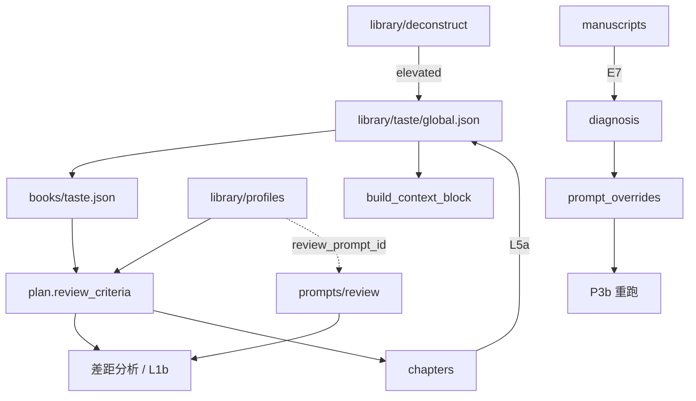

# 产品数据 Schema（定稿）

> **流程**：[workflow.md](./workflow.md) · **索引**：[product-plan.md](./product-plan.md)  
> **LLM fence**：[schemas.md](./schemas.md) · **现盘格式摘要**：[core/schemas/persist.py](../core/schemas/persist.py)

本文档消除结构设计中的「后患」：**单一真相源、命名统一、引用可解析、与现码路径对齐**。实现可分期，但 **不得** 再引入与本文冲突的平行字段。

---

## 一、全局约定（必读）

### 1.1 单一真相源

| 数据 | 真相源 | 禁止重复存储 |
|------|--------|----------------|
| 书名、书型、平台 slug、tagline | `books/{id}/project.json` | 不在 `library/index.json` 存 title/platform |
| 故事方向、章规划、审阅标准 | `books/{id}/plan.json` | 不用 `brief.md`（迁移后废弃） |
| 书架列表、当前激活书 | `library/index.json` | **不** 新增 `books/{id}/index.json` |
| 口味规则与示例正文 | `library/taste/global.json` v2 | 章 `summary` 推送后只留 `example_id` |
| 拆文原始分析 | `library/deconstruct/{id}.json` | 不属于 `taste/` 子目录 |
| 审阅执行 prompt | `prompts/review/{id}.yaml` | 与标准层分离 |
| 审阅检查项、投递模板 | `library/profiles/{id}.yaml` | 不塞进 review prompt 正文 |
| Prompt 节点覆盖 | `books/{id}/prompt_overrides.yaml` | 与 rules 职责分离 |
| 归因决策与重跑范围 | `books/{id}/diagnosis/{id}.json` | 可回链 `quality_log_id` |
| 章节正文（Phase 1） | `books/{id}/chapters/chNNN.md` | 与 plan 分工见 §5 |

**书级 lifecycle** 扩在 `project.json`（字段 `lifecycle`），与 **稿件** `manuscript.state` 区分：前者是「写作项目进度」，后者是「IP 交付物状态」。

### 1.2 命名与枚举

| 项 | 约定 |
|----|------|
| 平台 | 存盘 slug：`tomato` · `qimao` · `jjwxc` · `general`；展示用 `platform_label` |
| 书型 | `short` · `world` · `novel`（**无** `long`） |
| 章号 | 字段名 **`chapter_num`**（int），不用 `chapter_index` |
| Prompt 节点 | 现码 `node_id`：`writing.main` · `review.platform` · `prefill.plan` 等 |
| 投递类型 E4b | `text_editor` · `comic_drama` · `short_drama` |
| 章状态 | `pending` · `drafting` · `approved`（**approved** = L10b 概述确认后锁定） |
| 规则引用 | 带命名空间前缀，见 §1.3 |

### 1.3 规则引用（`RuleRef`）

`plan.review_criteria` 中的规则 id **必须**带前缀，解析器见 `core/schemas/rule_refs.py`：

```
global:rule_001      → library/taste/global.json → rules[]
local:local_rule_001 → books/{id}/taste.json → overrides.append_rules[]
profile:p_hard_001   → library/profiles/{profile_id}.yaml → checks.hard[]
custom:…             → plan.review_criteria.custom_checks[]（无 id 时用内容 hash）
```

读取审阅标准时：**合并** global + local override 权重 + profile checks + custom_checks，**不回写** global。

### 1.4 Prompt 与 Rules 边界

| | rules / review_criteria | prompt_overrides |
|--|-------------------------|------------------|
| 管什么 | **要什么**（内容标准） | **怎么做**（AI 执行方式） |
| 修改入口 | 开书确认、L5a、拒稿标签、拆文 elevated | **仅** Prompt 归因环确认写入 |

---

## 二、目录总览

```
library/
├── index.json                 # 书架：books[] + active_book_id
├── runtime.json
├── taste/
│   ├── global.json            # v2：rules + examples
│   └── events.jsonl           # 审计溯源，只追加
├── deconstruct/
│   └── {id}.json              # 拆文结构化结果（与 taste 平级）
├── profiles/
│   └── {id}.yaml              # 审阅标准 + 投递模板（标准层）
└── manuscripts/
    ├── index.json
    └── {id}.json

books/{id}/
├── project.json               # 书元数据 + lifecycle（无 per-book index.json）
├── plan.json                  # meta + chapters + review_criteria
├── taste.json                 # 本书口味覆盖
├── prompt_overrides.yaml
├── quality_log.jsonl          # 现码已有；审阅/拆文/归因 log
├── chapters/
│   ├── ch001.md               # Phase 1：单文件正文
│   └── {num}/                 # Phase 2 目标：版本/review/summary
│       ├── v1.md
│       ├── current.md
│       ├── review.json
│       └── summary.json
└── diagnosis/
    └── {id}.json              # 归因记录

prompts/review/                # 执行层：LLM system 文本（已有）
```

---

## 三、Library 级对象

### 3.1 `library/taste/global.json`（v2）

```json
{
  "version": 2,
  "updated_at": "2026-06-09 12:00:00",
  "rules": [
    {
      "id": "rule_001",
      "content": "钩子要在300字内出现",
      "weight": "hard",
      "source": "manual | deconstruct | elevated | judgment",
      "tags": ["hook", "opening"],
      "created_at": "2026-06-01",
      "linked_examples": ["ex_002"]
    }
  ],
  "examples": [
    {
      "id": "ex_001",
      "type": "good | bad",
      "text": "实际段落原文…",
      "annotation": "为什么好/坏",
      "tags": ["hook"],
      "source": "highlight | judgment | deconstruct | manual",
      "linked_rule": "rule_001",
      "book_id": "book_abc",
      "chapter_num": 3,
      "created_at": "2026-06-01"
    }
  ],
  "tag_stats": {}
}
```

**v1 兼容**：过渡期保留 `preferences`；迁移脚本将 `hook_patterns` 等升格为 `rules`（soft），见 §十。

### 3.2 `library/taste/events.jsonl`

只追加，不修改。结构化结果在 `global.json`；jsonl 作溯源。

```json
{"id":"evt-xxx","created_at":"…","source":"highlight","outcome":"accepted","issue_tags":["hook_strong"],"book_id":"…","chapter_num":3,"example_id":"ex_001"}
```

与现码 `core/taste.py` 字段兼容；新增可选 `example_id` / `rule_id` / `deconstruct_id`。

### 3.3 `library/deconstruct/{id}.json`

拆文是**输入素材**，elevated 后写入 global rules/examples。

```json
{
  "id": "decon_001",
  "source_title": "爆文标题",
  "source_platform": "tomato",
  "source_platform_label": "番茄",
  "source_url": "",
  "quality_log_id": "ql-xxx",
  "book_id": "book_abc",
  "created_at": "2026-06-01",
  "status": "raw | reviewed | elevated",
  "analysis": {
    "core_emotion": "",
    "hook_pattern": "",
    "beat_structure": [{"position": "开头", "description": ""}],
    "pacing_notes": "",
    "character_dynamics": "",
    "notable_techniques": []
  },
  "extracted": {
    "rules": ["rule_001"],
    "examples": ["ex_001"]
  }
}
```

### 3.4 `library/profiles/{id}.yaml`（标准层，新建）

与 `prompts/review/*.yaml`（执行层）分离；通过 `review_prompt_id` 关联。

```yaml
id: tomato_text_editor_v1
platform: tomato
platform_label: 番茄
submission_target: text_editor   # text_editor | comic_drama | short_drama
book_types: [short, novel]       # 适用书型
review_prompt_id: short-tomato   # → prompts/review/short-tomato.yaml
version: 1
updated_at: "2026-06-01"

checks:
  hard:
    - id: p_hard_001
      content: "首章3000字内必须出现核心冲突"
  soft:
    - id: p_soft_001
      content: "章均字数建议2000~3000字"

tone_preferences: ["节奏快", "钩子明显"]
forbidden: ["慢热超过5章"]

submission_template:
  required_fields: ["书名", "字数", "简介（100字内）", "前三章"]
  format: word
```

`plan.review_criteria.platform_profile` 存此文件的 `id`。

### 3.5 `library/manuscripts/{id}.json`

在现码基础上扩展（见 `core/manuscript.py`）：

```json
{
  "id": "ms_001",
  "book_id": "book_abc",
  "title": "…",
  "state": "draft | complete | submitting | result | revising",
  "submissions": [
    {
      "id": "sub_001",
      "target": "text_editor",
      "target_name": "番茄文学",
      "platform_profile": "tomato_text_editor_v1",
      "submitted_at": "2026-06-02",
      "result": "pending | accepted | rejected",
      "reject_reason": "",
      "reject_tags": ["pacing_slow"],
      "pushed_to_taste": true
    }
  ]
}
```

---

## 四、单书：`project.json`（取代 per-book index.json）

**决议**：不新增 `books/{id}/index.json`，避免与 `library/index.json` 三源同步。

```json
{
  "title": "书名",
  "world_label": "",
  "tagline": "",
  "notes": "",
  "type": "short",
  "platform": "tomato",
  "created_at": "2026-06-01T00:00:00",
  "updated_at": "2026-06-09T00:00:00",
  "lifecycle": {
    "status": "drafting | writing | complete | archived",
    "manuscript_id": null,
    "deconstruct_refs": ["decon_001"]
  }
}
```

| 字段 | 说明 |
|------|------|
| `lifecycle.status` | 书项目进度；**不是** manuscript.state |
| `lifecycle.manuscript_id` | 完结创建稿件后填入 |
| `lifecycle.deconstruct_refs` | 本书引用过的拆文 id 列表 |

`library/index.json` 的 `books[]` 条目继续由 `_book_entry()` 从 **project.json** 投影（现码行为），不持久化 title 的第二份副本。

---

## 五、`plan.json`

保留现码 **`chapters` 为 dict**（key = 章号字符串），扩展字段；短篇默认每章 1 个 scene。

```json
{
  "version": 2,
  "active_scene_id": null,
  "meta": {
    "logline": "",
    "sell_point": "",
    "tone": "",
    "chapter_count": 30,
    "word_count_per_chapter": 2000,
    "characters": [{"name": "", "role": "female_lead", "note": ""}]
  },
  "review_criteria": {
    "platform_profile": "tomato_text_editor_v1",
    "hard_rules": ["global:rule_001", "local:local_rule_001", "profile:p_hard_001"],
    "soft_rules": ["global:rule_002", "profile:p_soft_001"],
    "custom_checks": ["每章结尾必须有悬念或情绪钩子"]
  },
  "chapters": {
    "1": {
      "title": "第一章",
      "status": "pending | drafting | approved",
      "hook": "结尾钩子描述",
      "word_count_target": 2000,
      "scenes": [
        {
          "id": "ch1_abc123",
          "title": "场景",
          "beat": "Beat 描述",
          "done": false,
          "pace": "中",
          "summary": "",
          "updated_at": "2026-06-01T12:00:00"
        }
      ]
    }
  }
}
```

| 分工 | plan | chapters/ 文件 |
|------|------|----------------|
| 规划、状态、Beat、hook | ✅ | |
| 正文 prose | | ✅ |
| 审阅轮次明细 | | `review.json`（Phase 2）或 quality_log |
| 概述 | | `summary.json`（Phase 2）或 summaries_recent.md |

**P3b 锁定**：`status=approved` 的章在 `plan_only` 重跑中不受影响；`drafting` 章规划变更需警告覆盖草稿。

---

## 六、章节侧车文件（Phase 2）

### 6.1 `chapters/{num}/review.json`

```json
{
  "chapter_num": 3,
  "rounds": [
    {
      "round": 1,
      "version": "v1",
      "gaps": [
        {
          "rule_ref": "global:rule_001",
          "description": "钩子出现在第450字",
          "severity": "hard"
        }
      ],
      "judgment": "fail | pass",
      "issue_tags": ["hook_weak"],
      "quality_log_id": "ql-xxx",
      "user_note": "",
      "ts": "2026-06-01T10:00:00"
    }
  ]
}
```

### 6.2 `chapters/{num}/summary.json`

推送口味库后 **只留引用**（修正问题 4）：

```json
{
  "chapter_num": 3,
  "status": "pending | confirmed",
  "content": "本章概述…",
  "highlights_draft": [],
  "highlights": [
    {
      "example_id": "ex_001",
      "pushed_to_taste": true,
      "pushed_at": "2026-06-01T10:30:00"
    }
  ],
  "confirmed_at": "2026-06-01T10:30:00"
}
```

- 生成后、推送前：可暂用 `highlights_draft[{text, annotation}]`
- L5a 确认写入 global.examples 后：strip 为 `highlights[{example_id, …}]`

---

## 七、`books/{id}/taste.json`

```json
{
  "version": 2,
  "inherit_global": true,
  "overrides": {
    "rules": [{"ref": "global:rule_001", "weight": "soft"}],
    "append_rules": [
      {
        "id": "local_rule_001",
        "content": "本书男主不能主动示弱",
        "weight": "hard"
      }
    ],
    "append_examples": []
  },
  "notes": ""
}
```

`ref` 字段统一用 `global:rule_id` 形式。

---

## 八、`prompt_overrides.yaml` 与 `diagnosis`

### 8.1 目标结构（与 diagnosis.patch 同形）

```yaml
version: 2
nodes:
  writing.main:
    prepend: ""
    append: ""
    system: null          # 非空则整段替换（兼容现码）
  review.platform:
    prepend: ""
    append: ""
  prefill.plan:
    prepend: ""
    append: ""
```

现码仅 `system` 整段替换；resolver 升级后支持 prepend/append 折叠。

### 8.2 `books/{id}/diagnosis/{id}.json`

```json
{
  "id": "diag_001",
  "book_id": "book_abc",
  "created_at": "2026-06-09T10:00:00",
  "quality_log_id": "ql-xxx",
  "trigger": "chapter_fail | rejection",
  "trigger_ref": {"type": "chapter | submission", "id": "3 | sub_001"},
  "issue_tags": ["hook_weak", "pacing_slow"],
  "analysis": "AI 归因描述",
  "patch": {
    "target_node": "writing.main",
    "diff_preview": "给用户看的变更说明",
    "override": {
      "prepend": "写作前先列情绪节拍…",
      "append": "",
      "system": null
    }
  },
  "decision": {
    "accepted": true,
    "rerun_scope": "chapter_only | from_chapter_n | plan_only | none",
    "rerun_from_chapter_num": 3,
    "impact_preview": "将影响第3章规划；第1~2章已锁定",
    "decided_at": "2026-06-09T10:05:00"
  },
  "status": "pending | accepted | rejected"
}
```

写入 override 时：按 `patch.target_node` + `patch.override` 合并进 `prompt_overrides.yaml` 对应节点。

---

## 九、依赖关系



---

## 十、迁移路径

| 步骤 | 从 | 到 |
|------|----|----|
| M1 | `global.json` v1 `preferences` | v2 `rules`/`examples`；保留 v1 只读回退 |
| M2 | `brief.md` | `plan.meta`；预填 apply 改写入点 |
| M3 | 拆文仅在 quality_log | 升格 `library/deconstruct/{id}.json` |
| M4 | `scene.done` | 推导 `chapter.status`；L10b 后设 `approved` |
| M5 | 无 diagnosis 文件 | 从 `quality_log` kind=prompt_diagnose 投影 |
| M6 | `prompt_overrides` 仅 system | 增 prepend/append；旧数据 `system` 仍有效 |
| M7 | `summaries_recent.md` | Phase 2 迁 per-chapter `summary.json` |

**禁止**：同时维护 `brief.md` 与 `plan.meta` 为双真相源；禁止新增 `books/{id}/index.json`。

---

## 十一、实现 backlog（按依赖）

1. `core/schemas/rule_refs.py` — RuleRef 解析 ✅  
2. taste global v2 读写 + v1 迁移  
3. `plan.meta` / `review_criteria` / `chapter.status`  
4. `library/profiles` + profile 引用  
5. `library/deconstruct` 持久化  
6. L5a → examples + summary highlights 引用  
7. diagnosis 持久化 + patch 写入 override  
8. P3b impact_preview + 章锁定  
9. chapters/ Phase 2 目录  

---

相关：[workflow.md §三–§六](./workflow.md) · [product-plan.md](./product-plan.md)
