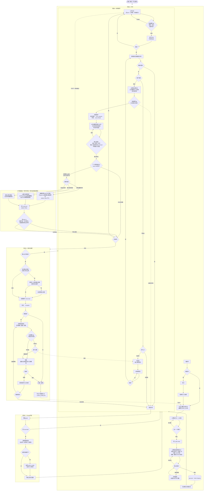

# 全流程手册

> **角色**：读者 + 审核者。AI 生产，你判断。  
> **交互**：AI 预填 → 你确认；预览 → 采纳才写盘。  
> API 实操见 `http://127.0.0.1:8765/docs`；机器可读流程见 `GET /api/prompts/flow`。  
> **章级叙事语法**（`role` / `intent` / A9 校验）见 **[chapter-roles.md](./chapter-roles.md)**；**排期**见 [canonical-status.md §七](./canonical-status.md)。

---

## 一、总流程图（定稿）

以下为产品定稿流程（含 2026-06 补丁 + 三方向新增）。图中 **不写 API 文件名**，实现映射见 §五。  
**★** = 2026-06 三方向新增节点；**虚线** = 可选 / 反馈路径（非主循环）。

### 1.1 四阶段布局（绘图用）

| 泳道 | 阶段 | 主色建议（对齐 `frontend/src/index.css`） |
|------|------|---------------------------------------------|
| 左 1 | **A · 开书** | `--color-primary` 墨绿 `#2d6a4f` |
| 左 2 | **L · 每章循环** | `--color-foreground` 正文色；决策菱形用 `--color-success` |
| 左 3 | **P · Prompt 归因** | `--color-warning` `#b45309`（反馈环，虚线汇入） |
| 左 4 | **E · 完结与投递** | `--color-muted` 边框 + `--color-accent` 底 |

**新增三点（★）在图中的锚位：**

| ★ | 节点 | 锚位 | 线型 |
|---|------|------|------|
| 1 | **AI 腔风险分** | 嵌在 `L1b` 机器预检内（并行项，最早拦截） | 实线；不过 → 回 `L1` |
| 2 | **读者视角（API 库存）** | 后端 `reader-preview` / `editor-preview` 仍可用；**写作页 UI 已移除 L2 Tab**（2026-06），改在中间栏读正文后 **L3 采纳** | 虚线（可选 API） |
| 2b | **节奏预警** | `L5a` 之后**独立节点** `L5b`（非「还有章?」内嵌） | 连续高风险 → **虚线** → `P1` |
| 3 | **合规预检** | `E4b` 与 `E5` 之间 `E4c` | 高风险回改 → **虚线** → `L7` |
| — | **风格提炼** | `E8` 复盘内可选 `E8b` | 资产 → `author_profile.json` → 回流 **A4** |

**E7 拒稿分叉（相对旧版修正）：** 先 **`E7` 写标签**（动作节点），再 **`E7a` 决策菱形**——**内容问题** → `P1`；**投递策略** → `E4b`。勿把 E7 与 E7a 画成同一节点。

**P1 汇入线（绘图核对）：**

| 来源 | 线型 | 说明 |
|------|------|------|
| `L4a` 主动归因 | **实线** → P1 | 差距分析后可选；单章崩塌不必等 L5 不通过 |
| `L6` 改规则 | **实线** → P1 | 主路径 |
| `L5b` 节奏预警 | **虚线** → P1 | 连续高风险时可选 |
| `E7a` 内容拒稿 | **实线** → P1 | 须经 E7 写标签后再分叉 |
| `E7a` 投递策略 | **实线** → E4b | **不进 P** |
| `E4c` 合规回改 | **虚线** → L7 | **不进 P** |

**2026-06 三条优化（相对上一版图）：**

| 节点 | 行为 |
|------|------|
| `L4a` | 差距分析后可 **主动触发归因**，不必等到 L5 不通过或 L5b 连续高风险 |
| `L5a` | 正向案例写入口味库时 **含冲突检测**（与既有规则/案例矛盾则提示）；不新增节点 |
| `P3c` / `P3d` | 写入 override 前可选 **调用风格资产**；支持当前书 / 其他书 `author_profile` |

**补丁说明（相对上一版）**

| # | 节点 | 行为 |
|---|------|------|
| 1 | `L5a` | 审阅通过后，AI 提取有效钩子/节奏等 → 口味库 **正向案例** |
| 2 | `E4b` | 投递前选类型 → 加载不同 **审阅标准** 与 **投递记录模板** |
| 3 | `L1b` | 写完后机器预检（字数、大纲关键词）；不达标自动打回 `L1`，不进预览 |
| 4 | `P3b` | 写入 override 前选 **重跑范围**（仅本章 / 从第 N 章 / 仅规划），确认后 `P4` |
| 5 | `E7` | 拒稿标签后 **分叉**：内容 → `P1`；投递策略 → `E4b`（旧版一律 P1 已废弃） |
| 6 | `L1b` | 并行 **AI 腔检测**；阈值按 `plan.meta.platform` 动态取 |
| 7 | `L3` | 预检通过后 **中间栏读全文** → **采纳 / 重新生成**（原 L2 双 Tab UI 已自写作页移除；API 仍库存） |
| 8 | `L5b` | `L5a` 后 **节奏预警**（近 3 章弃文风险）；虚线可选 → `P1` |
| 9 | `E4c` | 投递前 **合规预检**；高风险虚线回改 → `L7` 或忽略继续 |
| 10 | `E8b` / `A4` | 完结 **风格提炼** → `author_profile.json`；开书可 **继承** |
| 11 | `A8` / `A9b` | **轻量章规划**（前瞻）；单章编辑；**无写作模式分叉**（已移除 A10c） |
| 12 | `L10a` / `L10` / `L10b` | 档案维护 + **极简回顾**（≤50 字）；可跳过（auto confirmed） |
| 13 | `L10c` / **规划面板** | 下一章无规划时进入；常驻入口与章末触发 **同一面板** |
| 14 | `L4a` | 差距分析后 **主动归因**入口 → `P1` |
| 15 | `L5a` | 正向案例入库时 **冲突检测**（标注，不增节点） |
| 16 | `P3c` / `P3d` | 重跑前可选 **注入 author_profile**（本书 / 他书） |

**已与代码对齐**：`E3` 稿件状态为 **`complete`**（非 `completed`）。

---

## 二、四条铁律

1. **AI 预填 → 你确认**（方向、规划、概述、改稿）
2. **预览 → 采纳才写盘**（正文、规划、概述、prompt override）
3. **判断留痕**（`outcome` + `issue_tags`）→ 口味库；**通过时**沉淀正向案例（`L5a`）
4. **拒稿 / 改规则** → 改规则与**内容类拒稿**走 **Prompt 归因环**（`P1`）；**投递策略类拒稿**回 `E4b` 重选

---

## 三、核心概念（不写死文件名）

### 3.1 `plan.json`（规划真相源）

短篇优先：**方向与章规划合并在一个文件**，不再单独维护 `brief.md`（目标态；见 §六实现差距）。

| 字段 | 含义 | 何时写入 |
|------|------|----------|
| `meta` | 已确认方向：logline、卖点、基调、目标章数等 | 阶段 A，方向确认后 |
| `chapters` | 章标题、场景、Beat、钩子 | 阶段 A，规划确认后 |
| `review_criteria` | **审阅标准**（检查项清单，见下） | 开书末或拆文后，你确认后 |

`chapters` 结构与现有 `plan.json` 兼容；`meta` / `review_criteria` 已实现（见 `GET /api/plan/product`）。

### 3.2 审阅标准（Review Criteria）

**概念**：本章/本书「过不过」的对照清单（钩子、节奏、平台项等），供 `L4 差距分析` 使用。

| 维度 | 说明 |
|------|------|
| 来源 | 拆文规律、口味库、平台取向、你确认的补充项 |
| 行为 | AI 可建议条目；**你确认后才生效** |
| 与口味库 | 口味 = 长期偏好；审阅标准 = 检查项清单（可重叠，职责不同） |
| 与 prompt | 标准 = **查什么**；`review.platform` 等节点 = **怎么查、怎么写** |
| 落盘 | 由实现决定（`plan.review_criteria` 或等价配置）；**需求只定字段与行为** |

### 3.3 口味库

跨书 `global` + 本书 `taste` + 事件流 `events`：拆文、judgment、投递拒稿自动沉淀；预填/审阅/拆文时注入上下文。

### 3.4 Prompt 节点与 override

每个 pipeline 步骤对应 `node_id`（写作、预填、审阅、诊断等）。本书可在 `prompt_overrides` 覆盖；归因环 **preview → 确认写入**。

---

## 四、阶段说明

### 阶段 A · 开书

| 步骤 | 你的动作 | 说明 |
|------|----------|------|
| 新建书 | 选 type/platform | 短篇优先 `type=short` |
| 拆文（可选） | 粘贴爆文 | 规律进口味库；可提炼审阅标准候选 |
| 口味库（可选） | 配置 likes/dislikes | 一次配置，长期复用 |
| 预填方向 | 从 2～3 方案中选 | 确认 → **`plan.meta`** |
| 预填规划 | 确认章/Beat/钩子/**role**（轻量前瞻） | 确认 → **`plan.chapters`**；**A9b** 可单章编辑 |
| A9 校验 | 自动 | paywall 唯一、拉弓结构；长篇 `intent` 可选，短篇完整校验；详见 **[chapter-roles.md](./chapter-roles.md)** |
| 审阅标准 | 确认检查项清单 | → **`plan.review_criteria`**（plan 级 base；章级 overlay 由 role 动态加载） |
| 进入写作 | — | **无写作模式分叉**（已移除 A10c）；全书统一 Gate 全链 |

### 阶段 B · 每章循环

| 步骤 | 你的动作 | 说明 |
|------|----------|------|
| 写正文 | — | AI 读 plan + 口味 + 审阅标准 |
| 机器预检 | 无（自动） | 字数 + 大纲关键词 + **AI 腔**；不过 → 自动重写 |
| 预览正文 | 采纳? | **中间栏**读全文 + Gate「采纳 / **整章重新生成**」（`regenerate` 覆盖写盘，非续写） |
| 差距分析 | 读报告 | **按审阅标准**；Gate 可 **「按审阅标准改稿」**（L4 gaps → `revise_note`） |
| 主动归因 | 可选（**L4a**） | 报告异常时可 **不等 L5 不通过** 直接进 P1 |
| 不通过 | 改本章 / 改规则 | 改本章：标签 → 改稿 → 再审阅；改规则 → **阶段 C** |
| 审阅通过 | 无（自动） | **L5a** 正向案例（**含冲突检测**）；**L5b** 节奏预警（虚线可进 P1） |
| 章后回顾 | 通过 / 跳过 / 改写? | **L10a** 档案维护 → **L10** 极简回顾（≤50 字，目标态）；**L10b** 跳过 = auto confirmed |
| 下一章规划 | 自动检查 | **L10c**：下一章 `beat+role` 不全 → **规划面板**；开写前也可随时打开 |
| 下一章 | — | **L11**（**短篇 `type=short` 仍跳过 L10/L10b 概述 Gate**，实现保留） |

### 阶段 C · Prompt 归因

**统一入口 `P1`**：章审阅改规则（`L6`）、**L4a 主动归因**、**内容类拒稿（`E7a`）**、**节奏预警（`L5b` 虚线）** 进入此环。  
**不进 P1**：投递策略类拒稿 → `E4b`；合规回改 → `L7`（改稿环，非 prompt 归因）。

流程：归因 → 预览 patch → 是否写入 override → **选重跑范围（P3b）** → **可选调用风格资产（P3c/P3d）** → 确认执行（P4）→ 回阶段 B。

### 阶段 D · 完结与稿件

| 步骤 | 说明 |
|------|------|
| 未确认回顾 | 完结前软提示（仅非 skip 章）；`GET /api/flow/work-queue` → `pending_summary` |
| 创建稿件 | `manuscript`，`draft` |
| complete | 确认可交付 |
| 选择投递类型 | 文字编辑 / 漫剧 / 短剧 → 审阅标准 + 记录模板 |
| 投递 / 结果 | 拒稿 → 口味库 → **`E7a` 分叉**（内容→P1 / 策略→E4b） |

稿件状态：`draft → complete → submitting → result → revising → …`（详见 `core/manuscript.py`）。

---

## 五、当前 API 映射（实现对照）

| 流程节点 | 现有 API | 备注 |
|----------|----------|------|
| 新建书 | `POST /api/library/books` | |
| 拆文 | `POST /api/deconstruct` | |
| 规律进口味库 | `POST /api/taste/import-deconstruct` | |
| 配置口味库 | `PUT /api/taste/global` · `PUT /api/taste/book` | |
| 预填方向 | `POST /api/prefill/direction` → `apply` | ✅ 写 `plan.meta`；legacy `brief.md` 只读迁移 |
| 预填规划 A8/A9 | `POST /api/prefill/plan` → `apply` | 写 `plan.chapters`（目标：`role` + `intent`）；校验见 chapter-roles.md |
| 审阅标准 | `GET/PUT /api/plan/review-criteria` · `POST .../init` | |
| 写正文 | `POST /api/chat/stream` | |
| 机器预检 L1b | `POST /api/chapters/{n}/precheck` | 含 AI 腔；阈值见 `plan.meta.platform`；**前端在预览前执行** |
| 读者视角 L2（API 库存） | `POST /api/chapters/{n}/reader-preview` | 爽点密度 + 弃文风险；**写作页无 Tab**；读 `taste.reader_pattern` |
| 编辑视角 L2（API 库存） | `POST /api/chapters/{n}/editor-preview` | 平台编辑式点评；**写作页无 Tab** |
| 合规预检 E4c | `POST /api/compliance/preview` | body: `submission_target`；高风险虚线 → L7 |
| 节奏预警 L5b | `POST /api/chapters/{n}/rhythm-check` · `GET /api/flow/work-queue` | Gate `rhythm_gate`；`rhythm_warning` 字段 |
| 作者风格 E8b/A4 | `GET/POST /api/taste/author-profile` · `.../extract` · `.../apply` | `library/author_profile.json` |
| 读者口味 | `PUT /api/taste/book/reader-pattern` | 写入 `taste.reader_pattern` |
| 差距分析 | `POST /api/review/female-fiction` | 按 `resolved_criteria` |
| 正向案例 L5a | `POST /api/taste/highlights/{n}` · `POST .../conflicts` | ✅ 入库前冲突检测；`skip_conflict_check` 可强制 |
| L4a / L5b→P1 | `POST /api/chapters/{n}/attribution-log` · `POST /api/prompts/diagnose` | ✅ 无审阅记录时自动建 log；Complete 页 E7a→P1 |
| 打标签 | `POST /api/quality/log/{id}/judgment` | 同步口味库 |
| 改稿采纳 | `POST /api/review/female-fiction/accept` | |
| 概述 / 回顾 | `POST /api/post-chapter/finalize` → `GET/POST .../summary/confirm` | 侧车 `summary.json`；目标：**L10 极简 + L10b 可跳过** |
| 规划面板 | `POST /api/prefill/plan` · `apply(replace=false)` · `PUT /api/plan/...` | **目标态**；写作页常驻 + L10c 触发 |
| Prompt 归因 P1 | `POST /api/prompts/diagnose` · `diagnose/preview` | L6、E7 内容类、L5b 可选 |
| 重跑范围 P3b | `POST /api/rerun/preview` · `execute` · `pipeline` | `chapter_only` / `from_chapter_n` / `plan_only` |
| 风格资产 P3c/d | `POST /api/taste/author-profile/apply` · `POST /api/prompts/diagnose/decide` | ✅ 归因抽屉可选本书/他书 profile |
| 稿件 | `POST /api/manuscripts` · `PATCH` | `state: complete`；拒稿 `submission.reject_kind` → **E7a** 分叉 |
| 投递类型 E4b | `PATCH` `submission.target` | `text_editor` / `comic_drama` / `short_drama` |

---

## 六、实现差距

> **做了/没做/排期** 只维护 **[canonical-status.md](./canonical-status.md)**（**§三·一 定稿 vs 实现**、§三–§四 状态，§七 Track）。本文不再背平行 backlog。

| 类别 | 说明 |
|------|------|
| 主路径 A→L→P→E | MVP 已接（书架 / 向导 / Gate / 稿件 / 完结） |
| 结构脊柱 Track S | **S0–S4 ✅**（8 role 全 overlay） |
| Prompt 节点 UI | **P0 ✅**（设置 / 归因抽屉） |
| 工程债 | API 路径改名、多用户、E2E、session 恢复 UI → canonical §四 |
| 定稿图未落地项 | 规划面板、L10 拆分、L10b skip、A8 轻量 prompt 等 → **[canonical-status §三·一](./canonical-status.md)** |

---

## 七、Prompt 节点索引

| node_id | 阶段 |
|---------|------|
| `prefill.direction` | A |
| `prefill.plan` | A |
| `writing.main` | B |
| `review.platform` | B（执行审阅标准） |
| `maintain.summary` | B |
| `diagnose.prompt` | C |
| `check.deconstruct` | A（拆文） |

---

## 八、核对记录

| 决议 | 流程节点 |
|------|----------|
| 口味库（负向） | judgment、E7 拒稿标签 |
| 口味库（正向） | **L5a** 审阅通过亮点 |
| 投递/拒稿 | 阶段 D；**E4b** 类型 |
| Prompt 归因 | **L4a→P1**、**L6→P1**、**E7a 内容→P1**、**L5b 虚线→P1**；**E7a 策略→E4b**；**P3b** 重跑；**P3c/d** 风格资产 |
| 正向案例冲突 | **L5a** 入库冲突检测 |
| brief 并入 plan | A7 `plan.meta` |
| 审阅标准 | A10b、L4；按投递类型可覆盖 |
| 章后回顾 | L10a → L10 → L10b（可跳过）；规划前瞻见 **plan.json** + **规划面板** |
| 机器预检 | **L1b** 先于用户预览 |
| 完结前待确认回顾 | E1b–E1d · `pending_summary`（skip 章不计） |
| 写作模式 | **已移除**（无 A10c / `plan.meta.writing_mode`） |
| 合规 / 读者模拟 | **L1b** AI 腔 · **E4c** 全书扫描 · **L2 API**（无写作页 UI） |
| 节奏预警 | **L5b** · `retention.json` 侧车 |
| 跨书风格资产 | **E8b** 提炼 · **A4** 继承 · `author_profile.json` |

---

相关：[product-plan.md](./product-plan.md) · [chapter-roles.md](./chapter-roles.md) · [canonical-status.md](./canonical-status.md)
